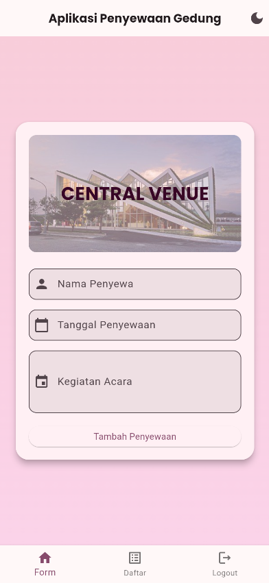
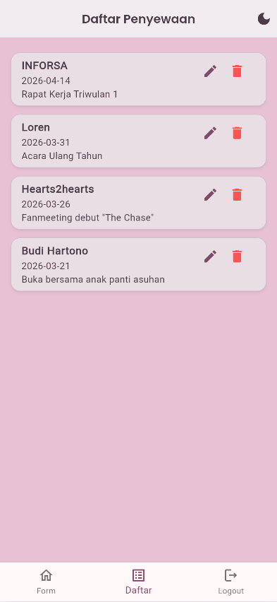
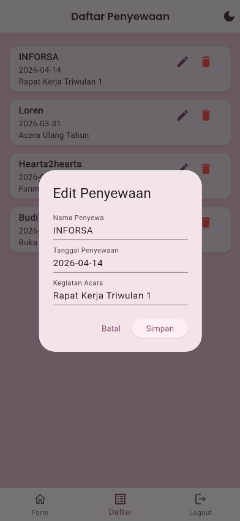
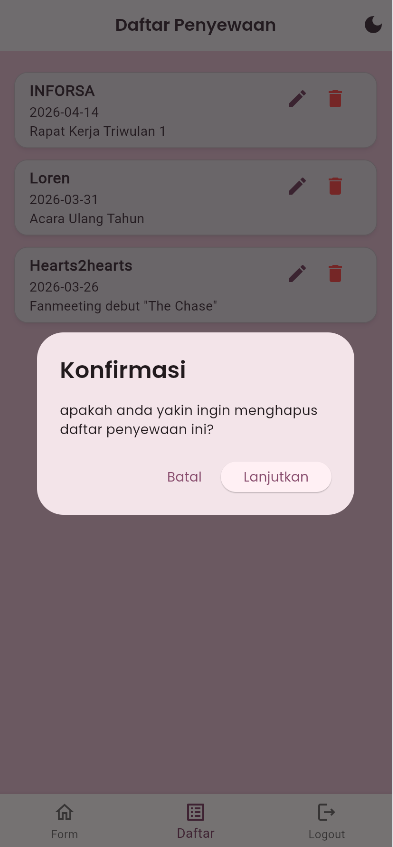
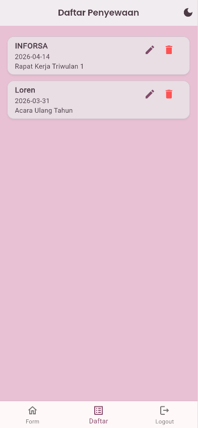
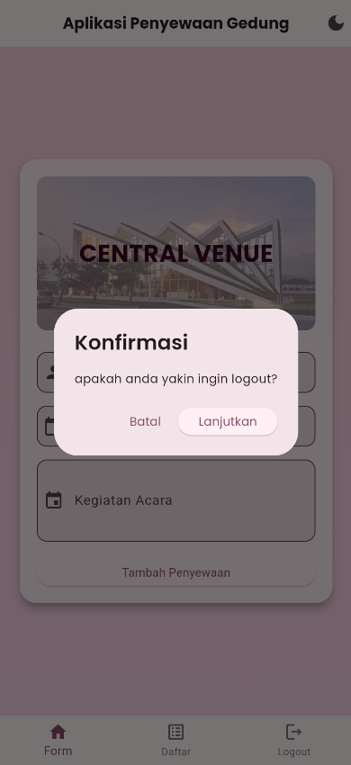
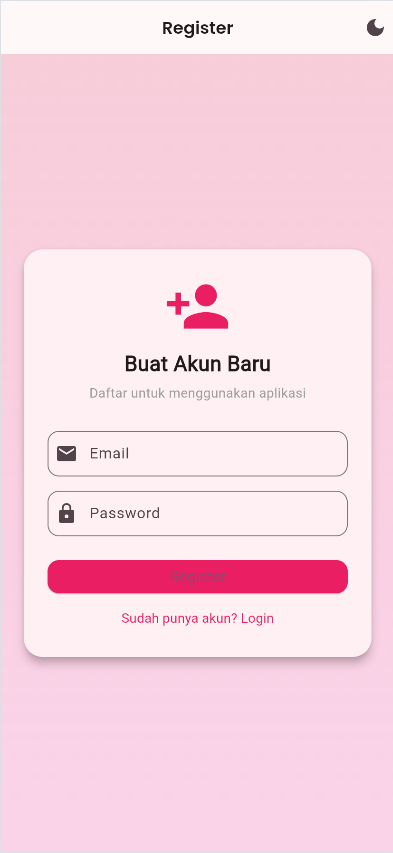
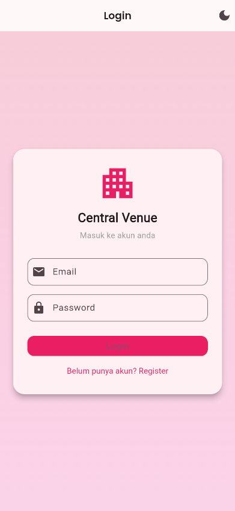
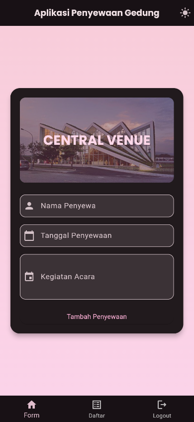

# Mini Project 2 PAB
# Alvionej Resna Lawrend Pandiangan 2409116073

## 📝 Deskripsi Aplikasi 
Aplikasi Penyewaan Gedung bernama Central Venue adalah aplikasi penyewaan gedung berbasis Flutter yang terintegrasi dengan Supabase. Pengguna dapat melakukan autentikasi (register/login), lalu mengelola data penyewaan gedung secara online dengan operasi CRUD. Aplikasi juga mendukung light/dark mode, navigasi antar halaman, serta konfirmasi aksi penting seperti logout dan hapus data.

## 🧩 Fitur Aplikasi

  ### - Create

Pengguna dapat menambahkan Penyewaan baru.

  ### - Read

Menampilkan seluruh data penyewaan gedung.

  ### - Update

Pengguna dapat mengedit data penyewaan yang telah dibuat sebelumnya.

  ### - Delete

Pengguna dapat menghapus penyewaan, dan daftar penyewaan akan otomatis diperbarui.

  ### - Logout

Pengguna dapat logout dari aplikasi.

  ### - Multi Page Navigation
1. Halaman utama

2. Daftar Penyewaan

3. Register

4. Login

5. Light & Dark Mode

  **- Light Mode**

  **- Dark Mode**

## 🧱 Widget yang Digunakan
 
🔹 Struktur Dasar Aplikasi

`GetMaterialApp` → Konfigurasi utama aplikasi 
`Scaffold` → Kerangka dasar halaman   
`AppBar` → Menampilkan judul halaman dan tombol aksi   
`GetX Navigation` (`Get.to`, `Get.off`, `Get.offAll`) → Perpindahan antar halaman  

🔹 Layout & Tampilan

`Container` → Styling tampilan  
`Card` → Membungkus konten agar tampil rapi seperti panel  
`Column` & `Row` → Menyusun widget secara vertikal dan horizontal  
`Center` → Menempatkan konten di tengah layar  
`Padding` & `SizedBox` → Mengatur jarak antar elemen  
`SingleChildScrollView` → Membuat konten bisa di-scroll saat overflow  
`ConstrainedBox` → Membatasi lebar agar UI tetap proporsional  
`Stack` + `Positioned` + `ClipRRect` → Menata gambar header dengan overlay  
`ListView.builder` → Menampilkan daftar data penyewaan secara dinamis  
`ListTile` → Menampilkan item data 
`Image.asset` → Menampilkan gambar dari asset lokal  

🔹 Input & Interaksi

`Form` + `TextFormField` → Input data penyewaan dengan validasi  
`TextField` → Input data pada dialog edit/login/register  
`showDatePicker` → Memilih tanggal penyewaan  
`ElevatedButton` → Tombol aksi utama  
`TextButton` → Tombol aksi sekunder  
`IconButton` → Tombol ikon 
`BottomNavigationBar` + `BottomNavigationBarItem` → Navigasi antar menu bawah  

🔹 Feedback & Notifikasi

`Get.snackbar()` → Menampilkan status sukses/gagal ke pengguna  
`AlertDialog` → Menampilkan konfirmasi aksi penting (logout, hapus)  

🔹 State Management

`GetX Controller` (`PenyewaanController`) → Mengelola data CRUD ke Supabase  
`Obx` → Merefresh tampilan otomatis saat data berubah  

🔹 Integrasi Backend

`Supabase Auth` → Login & register pengguna  
`Supabase Client` → Operasi Create, Read, Update, Delete data penyewaan
